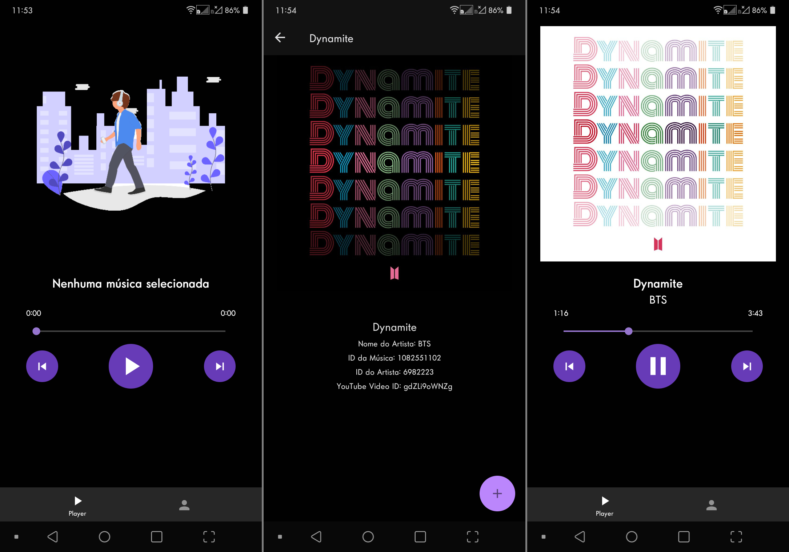

<h1 align='center'>Musicius</h1>

O Musicius é um player de música online, simples, fácil e sem anúncios. Você só compartilha a URL do vídeo do YouTube com ele, e pronto a música já entra na sua biblioteca.

## Screenshots

## Leia a wiki( em breve estará lá)
- Instalação
- Por de baixo dos panos

## Licença
Esse projeto está usando a licença MIT

 Obrigado por vim até aqui e beijinhos no ❤️ Feito com amor por gsbenevides2
